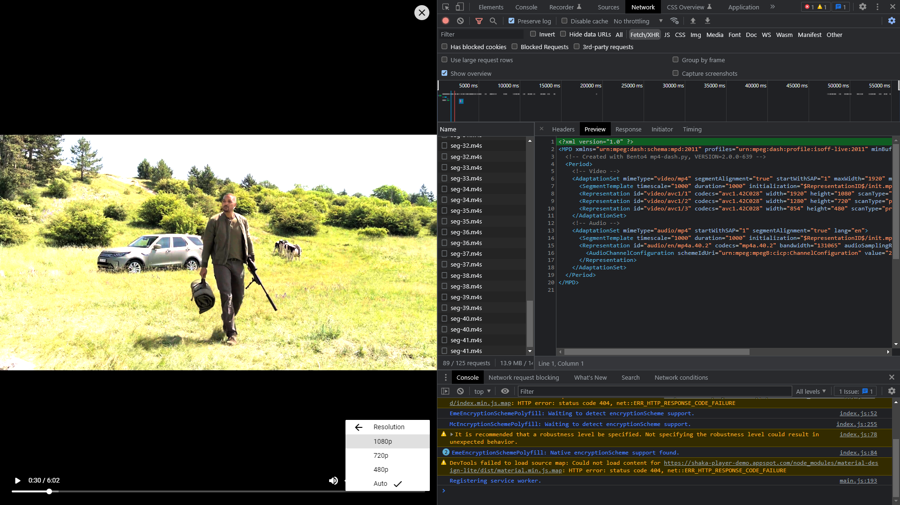
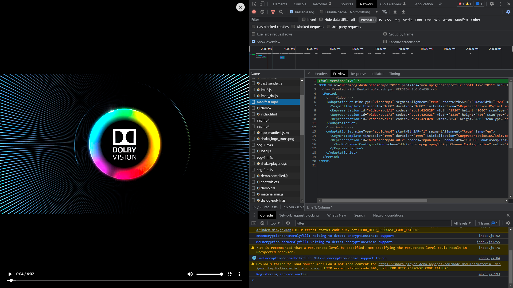

# MPEG-DASH & HLS NodeJS Online Streaming

Streaming a video online requires a smart techonology. **HLS** and **MPEG-DASH** streaming allows us to stream any video over HTTP giving a great user experience.
This application allows you to convert any standard video into HLS or MPEG-DASH Format and store it in **Firebase Storage**. The video has a unique URL which allows user to play the video in any supported player. 😄

**Title**: Sniper Will Smith (Gemini Man) Scene

**Sample URL**: [Play in Shaka Player](https://storage.googleapis.com/nodejs-streaming.appspot.com/uploads/f6b7c492-e78f-4b26-b95f-81ea8ca21a18/1642708128072/manifest.mpd)

**Manifest URL**: [Copy Link]([bit.ly/3gp7fdv](https://storage.googleapis.com/nodejs-streaming.appspot.com/uploads/f6b7c492-e78f-4b26-b95f-81ea8ca21a18/1642708128072/manifest.mpd))


**Credits**: The video is not owned by me. All rights owned by [Paramount Pictures](https://www.youtube.com/paramount)
## 🔰 Setting Up the Project
1. The project has a few external dependencies listed below which are required, So I have made a bash script - **dependencies.sh** which can easily install and setup the required dependencies on `Windows`, `MacOS` and `Linux`. For `Windows` you just need to write ```./dependencies.sh``` in *Git Bash* and for `MacOS` and `Linux` you need to run the same command in *Terminal*.
   - [Bento4](https://www.bento4.com/)
   - [Node Fluent FFMPEG](https://github.com/fluent-ffmpeg/node-fluent-ffmpeg) 
2. To start the project, first install the node modules via the command ```npm install``` and then to run the project in **PRODUCTION** mode use ```npm start``` and in **DEVELOPMENT** mode use ```npm dev```.

## 🔨 Architecture Design


## 📑 API Documentation
1. Upload Video

    Request Type| Endpoint | Meta
    ------------ | -------| -----|
    |`POST`|`/api/admin/upload` | Will allow you to upload video files and get session ID.

    **Headers:**
    Key | Value | Required
    ------------ | -------| -----|
    |`Content-Type`| `multipart/form-data` | False

    **Body:** 
    
        Type:form-data
        key: file, value: #FileToUpload

    **Response:**

        {
            "session":"f6b7c492-e78f-4b26-b95f-81ea8ca21a18",       <unique-session-id>
            "contentId":1642708128072,                              <unique-content-id>
            "fileType":".mp4",                                      <file-extension-type>
            "expiry":"22/1/2022, 1:18 am"                           <session-expiry>
        }

    **Developer's Note:**
    1.  The API had been beautifully designed to handle edge cases like `Max File Limit`, `Known File Types`, Fallback in case of Failure.
    2.  [Multer](#) Library has been used to handle the file upload. 
    3.  Proper Error Codes are also available to the user in Response.
   
2. Video Status API

    Request Type| Endpoint | Meta
    ------------ | -------| -----|
    |`GET`|`api/admin/:sessionID/status` | User must pass the session ID in the URL.

    **Headers:**
    Key | Value | Required
    ------------ | -------| -----|
    |None| None | 

    **Response:**

        {
            "session": "f6b7c492-e78f-4b26-b95f-81ea8ca21a18",
            "contentId": 1642708128072,  
            "fileType": ".mp4",
            "expiry": "22/1/2022, 1:18 am",
            "data": {
                "type": "timeline",
                "status": "complete",
                "jobs": {
                    "health": "success",
                    "fragments": "success",
                    "converting": "success",
                    "uploading": "success",
                    "cleaning": "success"
                }
            },
            "publicURL": "https://storage.googleapis.com/nodejs-streaming.appspot.com/uploads/f6b7c492-e78f-4b26-b95f-81ea8ca21a18/1642708128072/manifest.mpd"
        }

    **Developer's Note:**
    1.  This route is a ping route especially designed for frontend to show the current session updates and status of each job.
    2.  I have maintained a `status.json` file under each session which contains the above information and is updated every time a job is processed in the backend.
    3.  Once the `status` is successful, the `publicURL` of the video is visible in response.

## 📷 Screenshots




## 🏁 TODO / Extensions
  - [ ] Add support for multiple file uploads
  - [ ] Multiple Bitrate Enconding via FFMPEG
  - [ ] Delete/Restore User Session
  - [ ] Option to choose between HLS and MPEG-DASH